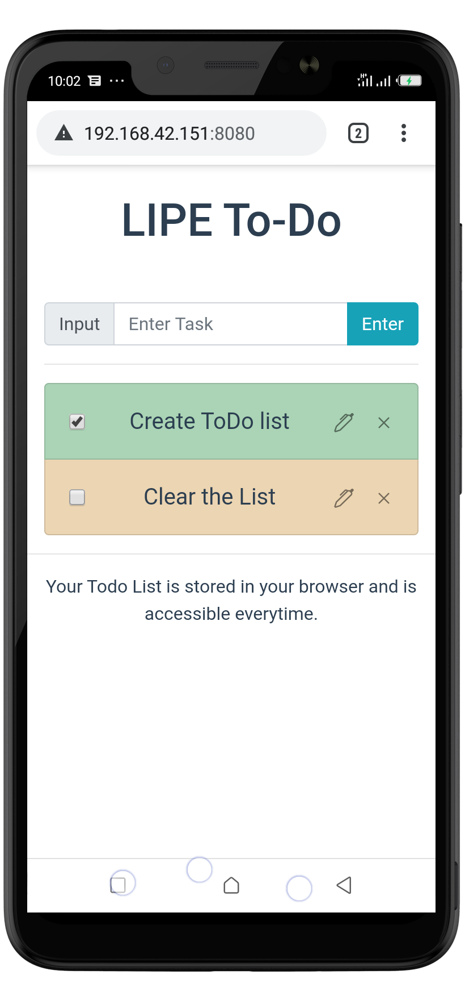
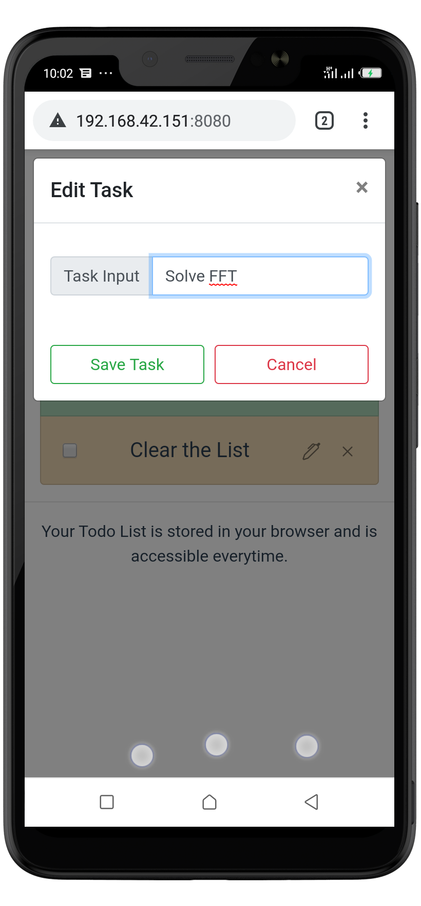
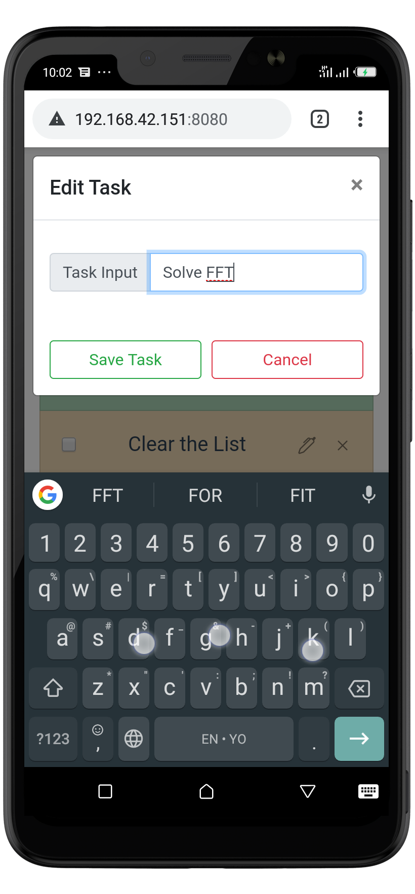

<h1> LIPE To-do </h1>
This a very minimal yet effective To do list implementation. The app was written using Vue.js and Bootstrap-Vue. Its features include 
<ul>
<li>Input of Task</li>
<li>Editing of Task</li>
<li>Marking of Task on completion</li>
<li>Storage of data Locally for constant availability</li>
<li>Installable on Google chrome browsers as a Progressive Web App</li>
</ul>

<a href ="https://lipe-todo-app.herokuapp.com">Click here </a> to visit a hosted version of the App

Here are some screenshots of the app as seen on an Android phone.

